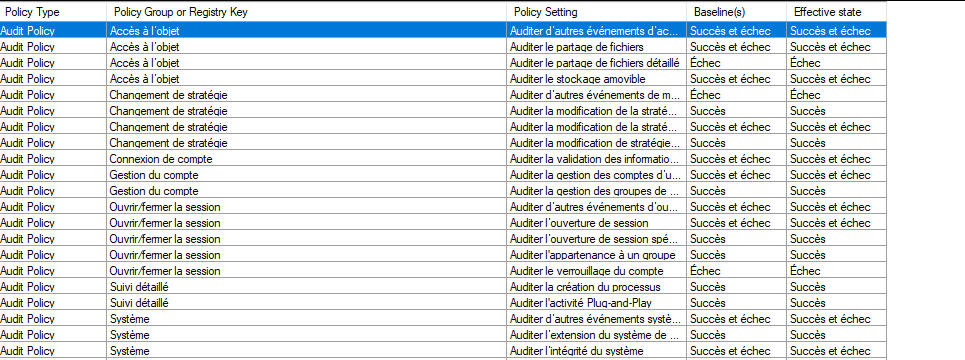
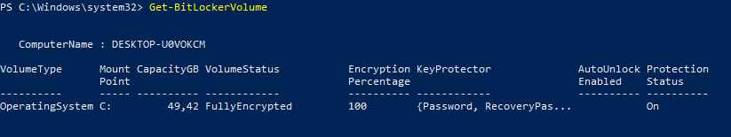
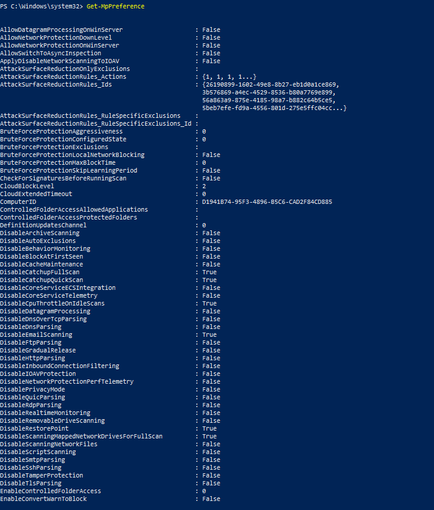
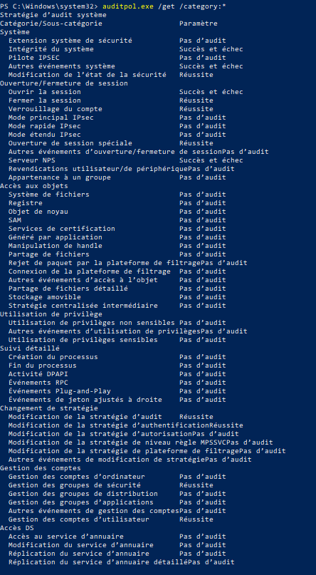
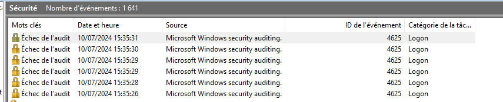

# Baseline Windows

## Question 

### 1️⃣ Utiliser auditpol pour l'authentification et les escalades de privilèges

``auditpol /set /category:"Connexion de compte" /failure:enable``

``auditpol /set /subcategory:"Ouvrir la session" /failure:enable``

### 2️⃣ Prouver la bonne configuration d'auditpol

## Livrables 

### 1️⃣ Comparatif des LGPO / GPO

### 2️⃣ Résultat de la commande `Get-BitLockerVolume`

### 3️⃣ Résultat de la commande `Get-MpPreference`

### 4️⃣ Résultat de la commande `auditpol.exe /get /category:*`

### 5️⃣ Captures des logs avec échec d'authentification et escalade de privilèges

