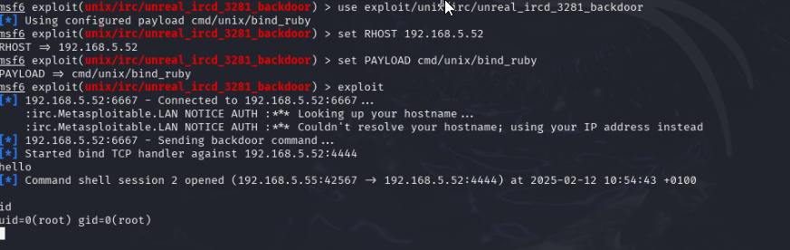

# Introduction a la cybersécurité

## Metasploit2 

### Scan nMap de la machine
Après avoir detecté notre machine, nous lancons un scan nMap pour obtenir les ports ouverts. (Nous utilisons aussi le paramètre "-sV" pour obtenir la version des services associés au ports)

Nous pourrons ainsi faire des recherche sur chacun de ces services individuellement

### Capture de paquet via Wireshark

Le telnet étant activé sur la machine, nous sommes sensibles a une attaque par surveillance de paquet, un intru avec wireshark pourrais par exemple voler notre informations d'identification

Comme on peut le voir ici, les paquets telnet sont transmis 1 byte par 1 byte, wireshark dispose cependant d'un fonctionnalité les regroupant

### Backdoor volontaire dans "vsftpd 2.3.4"

En cherchant des informations sur vsftpd 2.3.4, nous apprenons que celui ci est verollé, et permet l'ouverture d'un shell root si l'on fait une manipulation particulière
**(Source : https://westoahu.hawaii.edu/cyber/forensics-weekly-executive-summmaries/8424-2/)**

Cette manipulation est aussi possible avec la console metasploit

### Backdoor volontaire "Unreal IRCd"

Sur le port 6667, Unreal IRC a un daemon contenant une backdoor activée en lui envoyant "AB" suivie d'une commande systeme, l'outil msfconsole contient une facon de l'exploiter

## Attaques Web

### Injection XSS

Notre machine est aussi l'hote de pages web, nottament une sur laquelle se trouve un formulaire de lookup DNS, que l'on peut utiliser pour une injection XSS
En entrant notre script, nous pouvons executer des commandes système

Et notre commandes (alert) est bien éxécutée

