# Traffic Réseau, Wireshark

## 1️⃣ Rappels

* **Quelle est votre adresse IP, quel est sa classe ?**

    Mon adresse ip est 192.168.0.45, c'est une ip de classe C

* **Quel est votre masque de sous réseau**

    Mon masque de sous réseau est /24, ou 255.255.255.0

* **Quel est l'adresse de votre passerelle**

    Ma passerelle est en 192.168.0.1
## 2️⃣ Questions

### 0️⃣ Quels sont les flags TCP

* Les flags sont des bit contenus dans l'entête qui donnent une information sur la nature du paquet

* URG indique que le champ Pointeur de donnée urgente est utilisé.
* ACK indique que le numéro de séquence pour les acquittements est valide.
* PSH indique au récepteur de délivrer les données à l’application  et de ne pas attendre le remplissage des tampons.
* RST demande la réinitialisation de la connexion.
* SYN indique la synchronisation des numéros de séquence.
* FIN indique fin de transmission.

### 1️⃣ Capturer le processus DORA du DHCP

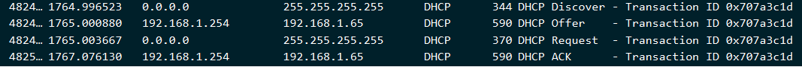

### 2️⃣ DHCP Starvation / DHCP snooping / Rogue DHCP 

* Une attaque DHCP Starvation est une attaque de type DoS qui vise a flooder le serveur DHCP de requêtes pour qu'il ai attribué toutes ses adresse disponible, et ainsi bloquer son fonctionnement
* Le DHCP Snooping est une fonctionnalité de couche 2 qui va bloquer les Offres DHCP venant d'une source suspecte et triant ses ports
* Un Rogue DHCP est un serveur DHCP qui n'a pas été installé par l'équipe infrastructure, par des raisons d'innatentions ou de malveillance

### 3️⃣ Que se passe t-il quand on fait un ipconfig /release, et en sécurité?

Lors d'un ipconfig /release, on désactive l'interface réseau sur laquelle on est connecté, coupant le traffic qui y passe.
En sécurite, on s'isole du réseau, reduisant les risque d'attaque. Attention, on est quand même branché physiquement au réseau, ce n'est pas sans faille

### 4️⃣ Quelle fonctionnalité CISCO pour prémunir les attaques DHCP

Le DHCP Snooping

### 5️⃣ Capturer une requette DNS et sa réponse

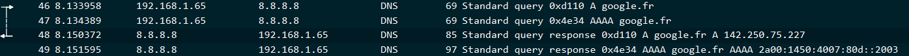

### 6️⃣ DNS Spoofing, comment s'en protéger ?

Le DNS Spoofing est une attaque consistant a se faire passer pour le service DNS dans un réseau, elle permet en suite de faire naviguer un utilisateur sur un site malveillant en changeant la résolution DNS.  
Pour s'en protéger, il est essentiel de vérifier les  domaines sur lesquels ont navigue, ainsi que de ne se connecter qu'a des réseaux en lesquels on a confiance 

### 7️⃣ DNS sec / DNS over TLS / HTTPS 

* Le DNS sec, Domain Name System Security Extensions, est un moyen de sécuriser les serveurs DNS avec une signature cryptographique

* Le DNS over TLS et HTTPS, comme leurs noms l'indiquent, sont des moyens de sécuriser des echanges DNS en les chiffrant, empêchant ainsi un tierce de les lires et/ou les alterer

### 8️⃣ Dans quels cas trouvent t-on du DNS sous TCP

Le DNS passe sous TCP quand sa taille dépasse les 512 bytes, ceci peut arriver du aux nouvelles fonctionnalités du DNS, ou a la taille des clés cryptographiques qui le sécurisent, comme le DNSSEC

### 9️⃣ Capturer un flux HTTP

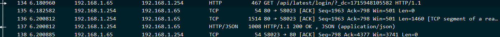 

### 🔟 HTTP Smuggling et sa CVE

Le HTTP Smuggling est l'acte d'injecter du code HTTP dans un paquet HTTP, permettant de le faire lire un paquet contenant du code malveillant, cette technique a nottament été utilisé pour partager la vulnerabilité CVE-2005-2088 qui permettais une attaque de HTTP Smuggling qui corrompais le Cache WEB et outrepassait les Pare-Feu des navigateurs

### 1️⃣1️⃣ Confidentialité et Authenticité HTTP

Le meilleur moyen de sécuriser HTTP est de le chiffrer, si possible asymetriquement, et donc le faire passer en HTTPS, solution utilisant TLS. Pour son authenticité, nous pouvons vérifier le domaine auquel nous somme connectés

### 1️⃣2️⃣ Qu'est-ce qu'une PKI ?

Une PKI est une infrastructure de sécurisation de l'intégrité de certificats numériques, et ainsi de certifier la légitimité des personnes, organisations, et services. Elle est constituée de beaucoup d'autres éléments, le plus important étant l'Autorité de Certification, qui délivrera les fameux "Certificats"

### 1️⃣3️⃣ Capturer un mot de passe avec Wireshark

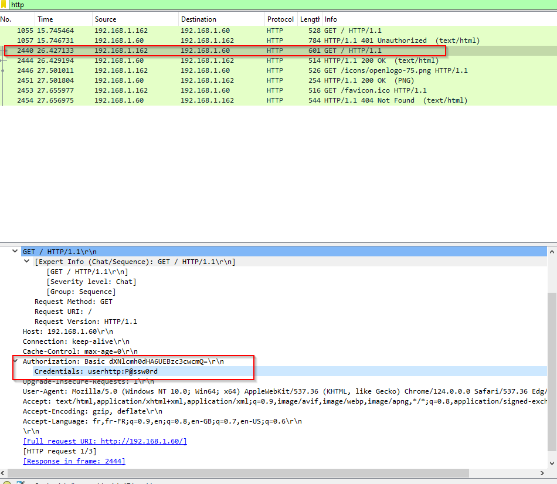

### 1️⃣4️⃣ Comment mettre en place la confidentialité pour ce service ? 

Pour mettre en place de la confidentialité pour ce service, il faudrait chiffrer nos échanges de bout en bout, ceci via un certificat TLS, donc par du HTTPS

### 1️⃣5️⃣ Capturer un paquet TLS

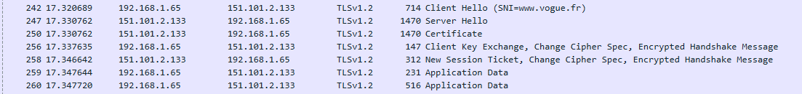

### 1️⃣6️⃣ Déchiffrer le traffic TLS avec votre certificat

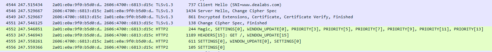

### 1️⃣7️⃣ Autorité de certification racine et intermediaire

Un certificat racine est un certificat qui identifie d'autres autorités de certifications (délégués) dans un modèle hierarchique (Une AC peut en autoriser une autre). Il est souvent contenu par défaut dans votre navigateur

Le certificat intermediaire agit comme "proxy" du certificat racine, pour pouvoir signer des certificats clients sans utiliser la signature du certificat racine, qui reste caché derrière plusieurs couches de sécurité

### 1️⃣8️⃣ Connectez-vous sur https://taisen.fr et affichez la chaine de confiance du certificat

On peut constater que notre certificat est signé par Let's Encrypt, qui fournissent des certificats SSL/TLS gratuits, qui sont considérés comme de confiance par l'autorité de certification racine de mon navigateur (Ici, Firefox)

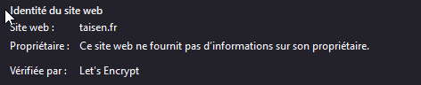

### 1️⃣9️⃣ Capturer une authentification Kerberos

Notre échange lors d'une authentification Kerberos se compose de
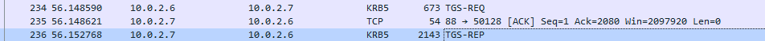

Voici un exemple avec le contenu de notre réponse

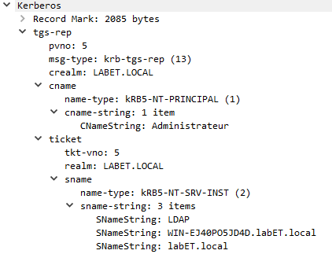

### 2️⃣0️⃣ Capturer une authentification RDP

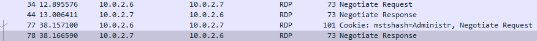

### 2️⃣1️⃣ Quelles sont les attaques connues sur NetLM ?

Les attaques connues sur NetLM sont des attaques de types Man In The Middle, intercéptant le traffic entre deux clients, le problème viens du fait que NetLM n'es pas crypté, et peut donc être intercépté en clair
Le NetLM pose aussi soucis car il fait des requètes DNS en clair, ce qui permettrais donc a un intrus de se faire passer pour l'hote NetLM

### 2️⃣2️⃣ Capturer une authentification WinRM

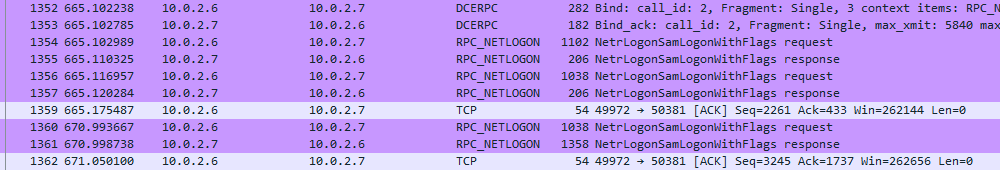

### 2️⃣3️⃣ Capturer une authentification SSH ou SFTP

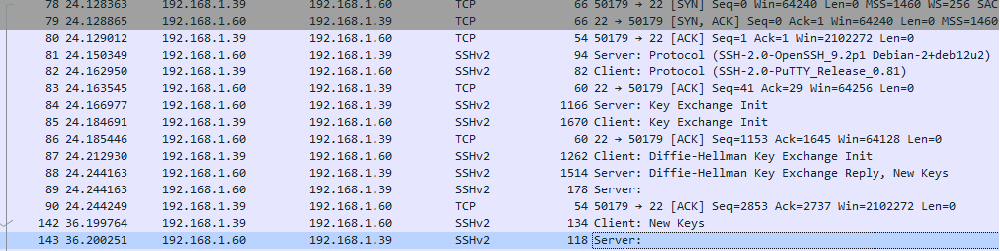

### 2️⃣4️⃣ Intercepter un fichier au travers du protocole SMB

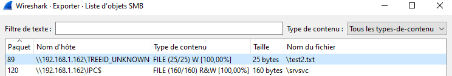

### 2️⃣5️⃣ Comment proteger l'authenticité et la confidentialité d'un partage SMB ?

Supprimer SMB 1 pour ne passer que sous SMB 2, et si possible, supprimer SMB 2 pour ne passer que sous SMB 3, qui est chiffré, utilise de la signature, et utilise de l'intégrité de pré-authentification

#

## FIN DU TP

PS : Les questions bonus sont ici les questions 16 et 25

Merci pour votre lecture

